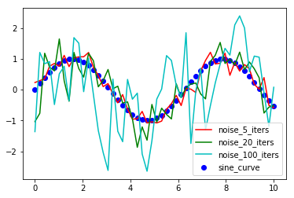
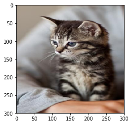
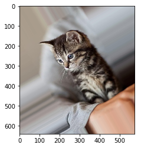
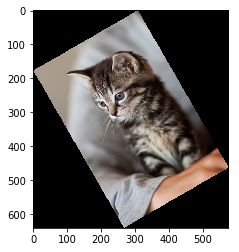
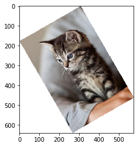
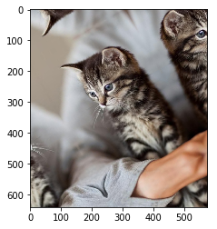
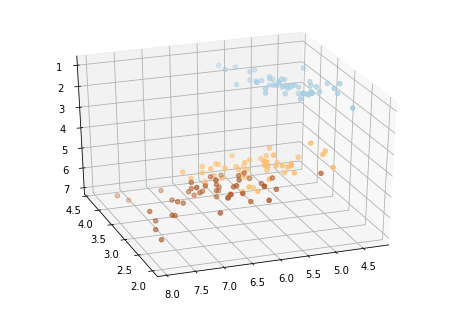
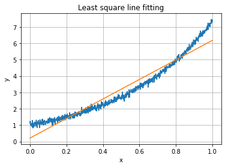

# COGS 181 - Homework 1
    
    
### 1 - Basic Matrix Operations Using Numpy

####
```python
import numpy as np

A = np.array([[1,3], [5,7], [9,11]])
A_transpose = np.transpose(A)
B = np.array([[1,-1], [-1,1], [-1, 0]])
B_transpose = np.transpose(B)

```
#### Answers

    ex 1
    [[ 0  4]
     [ 6  6]
     [10 11]]
    ex 2
    [[ 1 -3]
     [-5  7]
     [-9  0]]
    ex 3
    [[-13   4]
     [-15   4]]
    ex 4
    [[-2  2 -1]
     [-2  2 -5]
     [-2  2 -9]]
    ex 5
    Not Possible


### 2 - Basic Plots using Matplotlib


```python
import matplotlib.pyplot as plt
%matplotlib inline
np.random.seed(0)
space = np.linspace(0,10,num=50)
sine = np.sin(space)
plt.scatter(space, sine, color='b', label='sine_curve')
# 5 Iterations
sine_5 = sine
for i in range(5):
    sine_5 = sine_5 + np.random.normal(scale=0.1, size=50)
plt_sine_5 = plt.plot(space, sine_5, color='r', label='noise_5_iters')
plt.legend(loc='upper_right')

# 20 iterations
sine_20 = sine
for i in range(20):
    sine_20 = sine_20 + np.random.normal(scale=0.1, size=50)
plt_sine_20 = plt.plot(space, sine_20, color='g', label='noise_20_iters')
plt.legend(loc='upper_right')
# 100 iterations
sine_100 = sine
for i in range(100):
    sine_100 = sine_100 + np.random.normal(scale=0.1, size=50)
plt_sine_100 = plt.plot(space, sine_100, color='c', label='noise_100_iters')
plt.legend(loc='upper_right')

plt.savefig('.cogs181_Q2.png')
```





# 3 - Basic Image Operations Using Scipy

1. 
The shape of the image array is a matrix with 3 (RGB) values in each cell. 535x356x3 is the actual shape

The following images is the answers, in the order given in the homework.


```python
from scipy.misc import imread, imresize
import matplotlib.pyplot as plt 
%matplotlib inline
from scipy.ndimage import rotate
img = imread('tabby.jpg')

# Resized 
resized = imresize(img, (300,300))
plt.figure()
plt.imshow(resized)

# 1
reshaped1 = rotate(img, 30, reshape=True, mode='nearest', cval=0)
plt.figure()
plt.imshow(reshaped1)

# 2
reshaped2 = rotate(img, 30, reshape=True, mode='constant', cval=0)
plt.figure()
plt.imshow(reshaped2)

# 3 
reshaped3 = rotate(img, 30, reshape=True, mode='constant', cval=255)
plt.figure()
plt.imshow(reshaped3)

# 4
reshaped4 = rotate(img, 30, reshape=True, mode='reflect', cval=0)
plt.figure()
plt.imshow(reshaped4)
```


Resized



1.



2.



3.



4.




### 4 - Data and Visualization


```python
# 1
import matplotlib.pyplot as plt
from sklearn import datasets
from mpl_toolkits.mplot3d import Axes3D

# 2
iris = datasets.load_iris()
X = iris.data
Y = iris.target

# 3

plt.scatter(X[:,0], X[:,1], c=Y, cmap=plt.cm.Paired)

# 4
fig = plt.figure(1, figsize=(8, 8))
ax = Axes3D(fig, elev= -150, azim= 110)
ax.scatter(X[:,0],X[:,1], X[:,2], c=Y, cmap=plt.cm.Paired)

```
#### Output




### 5 - One-hot Encoding

In the one-hot encoding, the order **silver blue red black** is used.
$$
\left(
\begin{array}{cc}
182.3 & 62 & 1 & 0 & 0 & 0  \\
181 & 66 & 0 & 1 & 0 & 0  \\
186 & 56 & 0 & 0 & 1 & 0  \\
179 & 59 & 0 & 1 & 0 & 0  \\
182 & 50 & 0 & 0 & 0 & 1  \\
\end{array}
\right)
$$


### 6 - Linear Regression


```python
import matplotlib.pyplot as plt
import numpy as np

data = np.loadtxt('data.txt', dtype='float')

x = data[:,0].reshape(len(data),1)
y = data[:,1].reshape(len(data),1)

plt.grid()

X = np.hstack((np.ones((len(x),1)), np.power(x,1)))

X_t = X.transpose((1,0))
sol = np.dot(np.linalg.inv(np.dot(X_t, X)), np.dot(X_t,y))

plt.plot(x,y)

plt.plot(x,sol[0]+sol[1]*x)
plt.title('Least square line fitting')
plt.xlabel('x')
plt.ylabel('y')
```




