# COGS 181 - Homework 4 

## 1 - Hopfield Network


```python
from random import shuffle
import numpy as np
from copy import deepcopy

import matplotlib.pyplot as plt
from sklearn.metrics import * 
```


```python
def sign(k):
  return [-1, 1][k >= 0]
  
class HopfieldNetwork:
  
  def __init__(self, states):
    self.states = states
    self.m = len(states)
    self.n = len(states[0])
    self.W = np.zeros((self.n,self.n))
  

  def construct_weights(self):
    for i in range(self.n):
      for j in range(self.n):
        if i==j:
          continue
        self.W[i][j] = 0
        for s in range(self.m):
          self.W[i][j] += self.states[s][i] * self.states[s][j]
    self.W /= self.n
  
  def probing_pattern(self, V_new):
    self.U = deepcopy(V_new)
  
  def dynamic_evolution(self, visiting_order=None):
    last = None
    i = 0
    
    # Create a new visiting order if it 
    if visiting_order is None:
      visiting_order = range(self.n)
      shuffle(visiting_order)
    
    print "Initial state: ", self.U
    while last is None or not np.array_equal(last,self.U):


      for node in visiting_order:
        self.U[node] = sign(np.dot(self.W[node], self.U) / float(self.n))
        i += 1
        print "Iteration {}: U = {}".format(i, self.U)
      
      last = self.U 

    return self.U 


states = np.array([
  [-1, 1, 1, -1, 1],
  [1, -1, 1, -1, 1]
])
probing_pattern = np.array([1,1,1,1,1])
order1 = np.array([3,1,5,2,4]) - 1 
order2 = np.array([2,4,3,5,1]) - 1 

h = HopfieldNetwork(states)
h.construct_weights()
h.probing_pattern(probing_pattern)
print "Order: {}".format(order1)
print "Result: {}".format(h.dynamic_evolution(order1))
print "---"
h.probing_pattern(probing_pattern)
print "Order: {}".format(order2)
print "Result: {}".format(h.dynamic_evolution(order2))
```

    Order: [2 0 4 1 3]
    Initial state:  [1 1 1 1 1]
    Iteration 1: U = [1 1 1 1 1]
    Iteration 2: U = [-1  1  1  1  1]
    Iteration 3: U = [-1  1  1  1  1]
    Iteration 4: U = [-1  1  1  1  1]
    Iteration 5: U = [-1  1  1 -1  1]
    Result: [-1  1  1 -1  1]
    ---
    Order: [1 3 2 4 0]
    Initial state:  [1 1 1 1 1]
    Iteration 1: U = [ 1 -1  1  1  1]
    Iteration 2: U = [ 1 -1  1 -1  1]
    Iteration 3: U = [ 1 -1  1 -1  1]
    Iteration 4: U = [ 1 -1  1 -1  1]
    Iteration 5: U = [ 1 -1  1 -1  1]
    Result: [ 1 -1  1 -1  1]


### The evolving sequence
The evolving sequence of the pattern goes to the state that has the lowest energy for reach iteration. 
This is shown in the graphs below, where the energy for each state is marked with blue. 

The green numbers is the order number of the updates.

#### Order 1
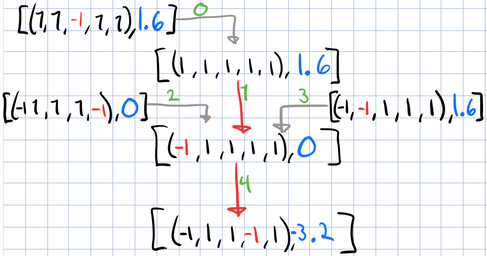
#### Order 2


## 2 - Visualizing Backpropagation with Circuit Diagrams


## 3 - Feed Forward Neural Network

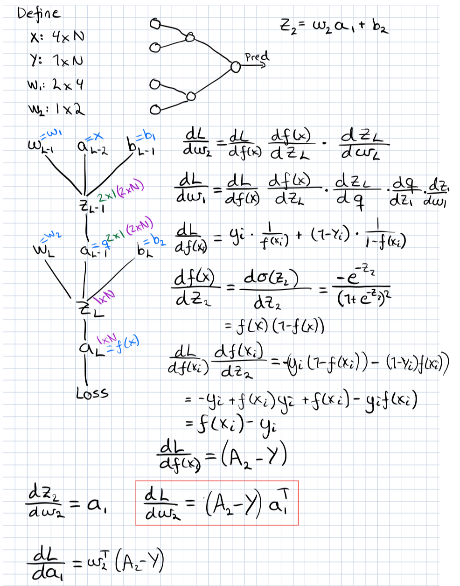


### Implementation


```python
# Prepare data
data = np.loadtxt('Q4_data.txt',
                  delimiter=',',
                  converters={-1: lambda s: {b'Iris-versicolor': 0,
                                             b'Iris-virginica': 1}[s]
                  })
#np.random.shuffle(data)
false_mask = np.where(data[:,4] == 0)[0]
true_mask = np.where(data[:,4] == 1)[0]

data_test = np.concatenate((data[false_mask[0:15]], data[true_mask[0:15]]))
data_train = np.concatenate((data[false_mask[15:]], data[true_mask[15:]]))
x_test = data_test[:, 0:4]
x_train = data_train[:, 0:4]
y_test = data_test[:,4]
y_train = data_train[:,4]
```


```python

def sigmoid(z):
  return 1 / (1+ np.exp(-z))

# Function f 
def f(x,w1,w2, b1, b2):
  assert w1.shape == (2,4), "Was {}".format(w1.shape)
  assert w2.shape == (1,2), "Was: {}".format(w2.shape)
  
  q = sigmoid(np.dot(w1,x)+b1)
  assert q.shape == (2,len(x[0])), "Was: {}".format(q.shape)

  res = sigmoid(np.dot(w2,q)+b2)
  assert res.shape == (1,len(x[0])), "Was: {}".format(res.shape)
  
  return res 

# Returns cross entropy loss
def error(x,w1,w2,b1,b2,y):
  preds = f(x,w1,w2,b1,b2)
  l = -np.sum(y * np.log(preds) + (1- y) * np.log(1-preds))
  return l
  
# Returns the accuracy
def accuracy(x,w1,w2,b1,b2,y):
  preds = f(x,w1,w2,b1,b2)
  return accuracy_score(y, preds.T > 0.5)
```


```python
def gradient_descent(x, y, w1,w2,b1,b2, max_iterations, alpha):
  n = len(x[0])
  assert y.shape == (n,), y.shape
  assert x.shape == (4,n), x.shape
  assert w1.shape == (2,4), w1.shape
  assert w2.shape == (1,2), w2.shape
  assert b1.shape == (2,1), db1.shape
  assert type(b2) == float
  
  m = float(n)
  losses = []
  accs = []
  for i in range(max_iterations):
    
    # Back propagation...
    q = sigmoid(np.dot(w1,x) + b1)
    
    assert q.shape == (2,n)
    
    q_1_q = q * (1-q)
    
    assert q_1_q.shape == (2, n)
    
  
    dL = f(x,w1,w2,b1,b2) - y
    assert dL.shape == (1,n)
    
    dw1 = np.dot(np.dot(w2.T, dL) * q * (1 - q), x.T)
    
    assert dw1.shape == (2,4)
    
    dw2 = np.dot(dL, q.T)
    
    assert dw2.shape == (1,2)
    
    db1 = np.sum(np.dot(w2.T, dL) * q_1_q, axis=1, keepdims=True)
    
    assert db1.shape == (2,1)
    
    db2 = float(np.sum(dL))
    
    assert type(db2) == float, "It was: {}".format(type(db2))
    
    w1 -= dw1 * alpha
    w2 -= dw2 * alpha
    b1 -= db1 * alpha
    b2 -= db2 *alpha
    
    e = error(x,w1,w2,b1,b2,y)
    losses.append(e)
    accs.append(accuracy(x,w1,w2,b1,b2,y))
  return losses, accs, w1,w2,b1,b2
    
```


```python
w1 = np.random.random((2,4))
w2 = np.random.random((1,2))
b1 = np.random.random((2,1))
b2 = np.random.random()
its = 10000
l,a,w1,w2,b1,b2  = gradient_descent(x_train.T, y_train, w1,w2,b1,b2, its, 0.001)

plt.figure()
plt.title("Cross entropy loss")
plt.plot( range(len(l)), l, '.', markersize="1", )

plt.figure()
plt.title("Accuracy")
plt.plot( range(len(a)), a, '.',markersize='2')

pred_test = f(x_test.T, w1,w2,b1,b2)
pred_test = pred_test > 0.5
print "Testing error:", 1- accuracy_score(y_test, pred_test.T)

pred_train = f(x_train.T, w1,w2,b1,b2)
pred_train = pred_train > 0.5

print "Training error:", 1- accuracy_score(y_train, pred_train.T)

plt.show()
```

    Testing error: 0.133333333333
    Training error: 0.0


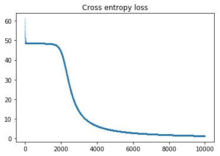


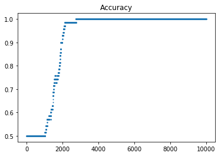


## 4- Multilayer Perceptron


```python
from sklearn.datasets import fetch_mldata
mnist = fetch_mldata("MNIST original")
from sklearn.neural_network import MLPClassifier

```


```python
# Concatinate data to shuffle
data = np.column_stack((mnist['data'],mnist['target']))
assert data.shape == (70000, 785)
#np.random.shuffle(data)
# Separate data
x_train = data[:60000, :-1]
x_test = data[60000:, :-1]
y_train = data[:60000, -1]
y_test = data[60000:, -1]
batch_size = 1000
max_epoch_its = len(x_train) / batch_size
```

### 1)

* We notice from the graphs that the Adam solver is converging faster than the SGD model. Also both classifiers are close to convergence by one epoch.
* The Adam solver generates a better testing accuracy.
* The Adam solver stops at a training error somewhat smaller than SGD.


```python
def clf(layer, activation, solver, batch_size, max_iter, title):
  mlpc = MLPClassifier(layer, activation=activation, solver=solver, batch_size=batch_size, max_iter=max_iter, shuffle=True, random_state=1)
  mlpc.fit(x_train, y_train)
  plt.figure()
  plt.xlabel("Iterations")
  plt.ylabel("Loss")
  plt.title(title)
  plt.plot(range(len(mlpc.loss_curve_)), mlpc.loss_curve_)
  plt.show()
  print "Testing accuracy:", mlpc.score(x_test, y_test)
```


```python
clf({60}, 'relu', 'adam', batch_size, max_epoch_its, 'Adam Loss')
```


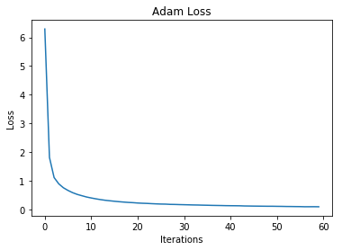


    Testing accuracy: 0.9387


```python
clf({60}, 'relu', 'sgd', batch_size, max_epoch_its, 'SGD loss')
```


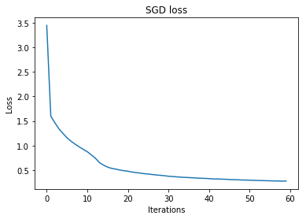


    Testing accuracy: 0.9149


## 2)

* The adam model with 20 units is converging quite slowely, while the other two models are converging rapidly. The adam model with 100 units converges with only 40 iterations.
* The testing accuracy is the highest for the adam solver with 100 units. This corresponds to the capacity of our model.
* 


```python
clf({20},'relu', 'adam', batch_size, max_epoch_its, 'Adam 20 units')
clf({50},'relu', 'adam', batch_size, max_epoch_its, 'Adam 50 units')
clf({100},'relu', 'adam', batch_size, max_epoch_its, 'Adam 100 units')
```


    Testing accuracy: 0.8998


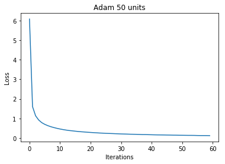


    Testing accuracy: 0.9374


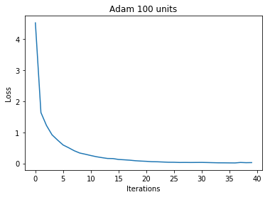


    Testing accuracy: 0.953


## 3)

* The adam solver with 3 layers is converging quite slow, and the fewer layers it has the faster it converges
* The testing accuracy is higher for the one with the fewest layer in this example.


```python
clf({60},'relu', 'adam', batch_size, max_epoch_its, 'Adam loss one layer 60 units')
clf({30,30},'relu', 'adam', batch_size, max_epoch_its, 'Adam loss two layers, 30 units in each')
clf({20,20,20},'relu', 'adam', batch_size, max_epoch_its, 'Adam loss three layers, 20 in each')
```


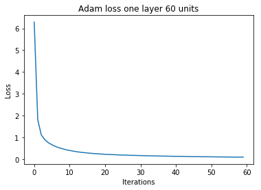


    Testing accuracy: 0.9387


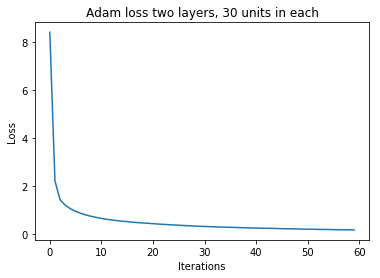


    Testing accuracy: 0.9292


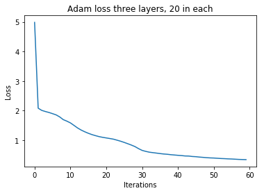


    Testing accuracy: 0.8998


### 4)

The testing accuracy for the different models:

* 3 layers = 0.8998
* 2 layers = 0.9292
* 1 layer  = 0.9387


The classifier with the highest performance has the setting:

* 1 Layer with 60 units
* batch_size=1000
* solver = adam
* shuffle=True
* random_state=1
* max_iter = 60 (1 epoch)
