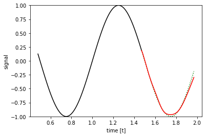

```python
import os
os.environ["CUDA_VISIBLE_DEVICES"]="0"
import sys
import tensorflow as tf
from tensorflow.contrib import rnn
import numpy as np
import matplotlib
import matplotlib.pyplot as plt
```

## Generate Samples (to be filled)
This section generates some samples for sine function $y = F(t)$:
$$ y = F(t) = \sin(2\pi f (t+t_0)) $$
Here, in each batch, given a series of time points $t_1,t_2,...,t_n$ ($n = n_{samples} + n_{predict}$), we want to generate a series of function values $y_1,y_2,...,y_n$. We use $t_0$ as a randomizer to make each batch start from different time point (different phase). Then, we will collect first $n_{samples}$ function values $y_1,y_2,...,y_{n_{samples}}$ as input vector $\mathbf{y}_{samples}$ and next $n_{predict}$ function values $y_{n_{samples}+1},y_{n_{samples}+2},...,y_{n_{samples}+n_{predict}}$ as input vector $\mathbf{y}_{predict}$. Here we use `seq2seq` model, where $n_{predict}=1$.


```python
def generate_sample(f = 1.0, batch_size = 1,
                    predict = 1, samples = 100):
    """
    Generates data samples.
    :param f: The frequency to use for all time series.
    :param batch_size: The number of time series to generate.
    :param predict: The number of future samples to generate.
    :param samples: The number of past (and current) samples to generate.
    :return: Tuple that contains the past times and values as well as the future times and values. In all outputs,
             each row represents one time series of the batch.
    """
    const = 100.0

    # Empty batch vectors.
    T = np.empty((batch_size, samples))
    Y = np.empty((batch_size, samples))
    FT = np.empty((batch_size, predict))
    FY = np.empty((batch_size, predict))

    for i in range(batch_size):
        # We define the range of t here.
        t = np.arange(0, samples + predict) / const
        
        # Here we want to sample some points for sine function.
        t0 = np.random.choice(t,1)[0]
        y = np.sin(2*np.pi*f*(t+t0))

        T[i, :] = t[0:samples]+t0       # t_1 ... t_{n_samples}
        Y[i, :] = y[0:samples]        # y_1 ... y_{n_samples}

        FT[i, :] = t[samples:samples+predict] + t0       # t_{n_samples+1} ... t_{n_samples+n_predict}
        FY[i, :] = y[samples:samples+predict]       # y_{n_samples+1} ... y_{n_samples+n_predict}
        
    return T, Y, FT, FY
```

## RNN Model (to be filled)
This section builds a RNN model. The model is like:
$$ \hat{\mathbf{y}}_{predict} = \tanh(Linear(RNN(\mathbf{y}_{samples}))) $$ 


```python
# State size = n_steps
def RNN(x, weights, biases, n_input, n_steps, n_hidden):
  # Prepare data shape to match `rnn` function requirements
  # Current data input shape: (batch_size, n_steps, n_input)
  # Required shape: 'n_steps' tensors list of shape (batch_size, n_input)

  # Permuting batch_size and n_steps
  x = tf.transpose(x, [1, 0, 2])
  # Reshaping to (n_steps*batch_size, n_input).
  x = tf.reshape(x, [-1, n_input])
  # Split to get a list of 'n_steps' tensors of shape (batch_size, n_input).
  x = tf.split(x, n_steps, axis=0)
  # Define a RNN cell with TensorFlow.
  rnn_cell = rnn.BasicLSTMCell(num_units=n_hidden, forget_bias=1.0)

  # Get RNN cell output.
  # Hint: Use rnn.static_rnn()
  outputs, states = rnn.static_rnn(rnn_cell, x, initial_state=None, dtype=tf.float32, scope='rnn')

  # Linear layer and tanh activation, using RNN inner loop last output.
  # Hint: Use tf.tanh, tf.nn.bias_add(), tf.matmul(), weights, biases.
  final_output = [tf.tanh(tf.nn.bias_add(tf.matmul(out, weights), biases)) for out in outputs]

  return final_output[-1]
```

## Parameters and Network Building
This section sets the parameters and builds the network.


```python
tf.reset_default_graph()
# Parameters
learning_rate = 0.001
training_iters = 50000
batch_size = 50
display_step = 100

# Network Parameters
n_input = 1     # Input is sin(x).
n_steps = 100   # Timesteps.
n_hidden = 100  # Hidden layer num of features.
n_outputs = 1   # Output is sin(x+1).

# tf Graph input
x = tf.placeholder("float", [None, n_steps, n_input])
y = tf.placeholder("float", [None, n_outputs])

# Define weights
weights = tf.Variable(tf.random_normal([n_hidden, n_outputs]))
biases = tf.Variable(tf.random_normal([n_outputs]))

pred = RNN(x, weights, biases, n_input, n_steps, n_hidden)

# Define loss (Euclidean distance) and optimizer.
individual_losses = tf.reduce_sum(tf.squared_difference(pred, y), reduction_indices=1)
loss = tf.reduce_mean(individual_losses)
optimizer = tf.train.AdamOptimizer(learning_rate=learning_rate).minimize(loss)

# Initializing the variables.
init = tf.global_variables_initializer()

# Set dynamic allocation of GPU memory rather than pre-allocation.
# Also set soft placement, which means when current GPU does not exist, 
# it will change into another.
config = tf.ConfigProto(allow_soft_placement = True)
config.gpu_options.allow_growth = True
```

## Network Training.
This section trains the network.


```python
# Launch the graph.
sess = tf.Session(config=config)
sess.run(init)

step = 1
# Keep training until reach max iterations.
while step * batch_size < training_iters:
    _, batch_x, __, batch_y = generate_sample(f=1.0, batch_size=batch_size, samples=n_steps,
                                              predict=n_outputs)

    batch_x = batch_x.reshape((batch_size, n_steps, n_input))
    batch_y = batch_y.reshape((batch_size, n_outputs))

    # Run optimization op (backprop).
    sess.run(optimizer, feed_dict={x: batch_x, y: batch_y})
    if step % display_step == 0:
        # Calculate batch loss.
        loss_value = sess.run(loss, feed_dict={x: batch_x, y: batch_y})
        print("Iter " + str(step * batch_size) + ", Minibatch Loss= " +
              "{:.6f}".format(loss_value))
    step += 1
print("Optimization Finished!")
```

    Iter 5000, Minibatch Loss= 0.005657
    Iter 10000, Minibatch Loss= 0.005032
    Iter 15000, Minibatch Loss= 0.002268
    Iter 20000, Minibatch Loss= 0.000544
    Iter 25000, Minibatch Loss= 0.000430
    Iter 30000, Minibatch Loss= 0.001009
    Iter 35000, Minibatch Loss= 0.000277
    Iter 40000, Minibatch Loss= 0.000251
    Iter 45000, Minibatch Loss= 0.000253
    Optimization Finished!


## Network Evaluation and Visualization.
This section evaluates the network and gives a visualization of result.

** Attention **
You may be frustrated because your result is not like the given figure (though the given figure is also not that good). Do not worry to much. Your implementation may be correct and this `seq2seq` model is not that strong. You can re-run the notebook for a couple of times (`Kernel` -> `Restart & Run All`) and then select the best result image to report.


```python
# Test the prediction.
t, start_y, next_t, expected_y = generate_sample(f=1, samples=n_steps, predict=50)

pred_y = []
y = start_y

for i in range(50):
    test_input = y.reshape((1, n_steps, n_input))
    prediction = sess.run(pred, feed_dict={x: test_input})
    prediction = prediction.squeeze()
    pred_y.append(prediction)
    y = np.append(y.squeeze()[1:], prediction)
```


```python
# Remove the batch size dimensions.
t = t.squeeze()
start_y = start_y.squeeze()
next_t = next_t.squeeze()

plt.plot(t, start_y, color='black')
plt.plot(np.append(t[-1], next_t), np.append(start_y[-1], expected_y), color='green', linestyle=':')
plt.plot(np.append(t[-1], next_t), np.append(start_y[-1], pred_y), color='red')
plt.ylim([-1, 1])
plt.xlabel('time [t]')
plt.ylabel('signal')

plt.show()
```




