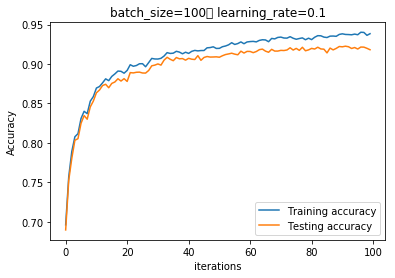
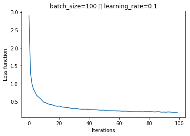
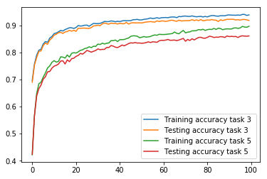
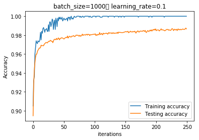
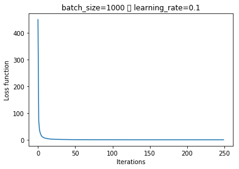
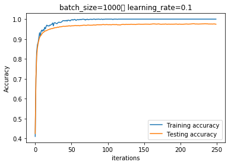
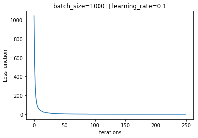
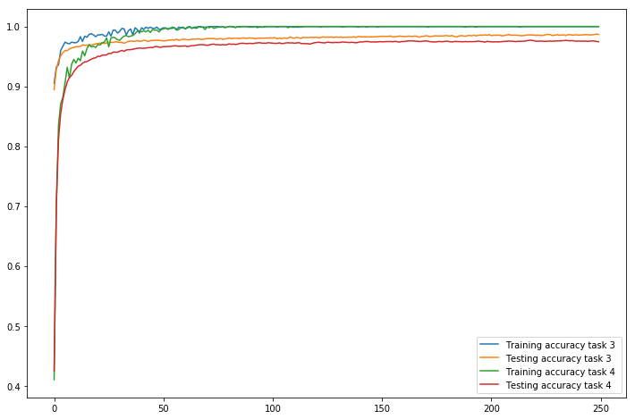

# COGS 181 - Homework 5


```python
from sklearn.datasets import fetch_mldata
mnist = fetch_mldata("MNIST original")
from sklearn.neural_network import MLPClassifier
from sklearn import preprocessing
import numpy as np
import matplotlib.pyplot as plt
import tensorflow as tf
from time import time
from tensorflow.contrib import rnn
```


```python
# Concatinate data to shuffle
data = np.column_stack((mnist['data'],mnist['target']))
assert data.shape == (70000, 785)
np.random.shuffle(data)
```


```python
# One hot encode labels
y = np.matrix(data[:,-1]).T
oneHotEncoder = preprocessing.OneHotEncoder()
oneHotEncoder.fit(y)
y = oneHotEncoder.transform(y).toarray()
assert y.shape[1] == 10
```


```python
x = data[:,:-1] 
```


```python
# Separate data
train_size = 60000
x_train = x[:train_size, :]
x_test = x[train_size:, :]
y_train = y[0:train_size]
y_test = y[train_size::]


```

## Task 1


```python
batch_size = 100
training_epochs = 100

display_step = 4
n_hidden_1 = 300 # Nodes in first hidden layer
n_input = 28*28 # Nodes in input layer
n_classes = 10 # Nodes in output layer
learning_rate = 0.1
```


```python
X = tf.placeholder(tf.float32, [None, n_input])
Y = tf.placeholder(tf.float32, [None, n_classes])


weights = {
  'h1': tf.Variable(tf.random_normal([n_input, n_hidden_1])),
  'out': tf.Variable(tf.random_normal([n_hidden_1, n_classes]))
}

biases = {
  'b1': tf.Variable(tf.random_normal([n_hidden_1])),
  'out': tf.Variable(tf.random_normal([n_classes]))
}

```


```python
def multilayer_perceptron(x):
  hidden_layer = tf.sigmoid(tf.add(tf.matmul(x, weights['h1']), biases['b1']))
  out_layer = tf.matmul(hidden_layer, weights['out']) + biases['out']
  return out_layer

logits = multilayer_perceptron(X)
  
```


```python
loss_op = tf.reduce_mean(tf.nn.softmax_cross_entropy_with_logits(logits=logits, labels=Y))

train_step = tf.train.GradientDescentOptimizer(learning_rate).minimize(loss_op)
```


```python
def plot_statistics(train_accs, test_accs, losses, batch_size, learning_rate):
  plt.title("batch_size={}\t learning_rate={}".format(batch_size, learning_rate))
  plt.xlabel("iterations")
  plt.ylabel("Accuracy")
  plt.plot(range(len(train_accs)), train_accs, label="Training accuracy")
  plt.plot(range(len(test_accs)), test_accs, label="Testing accuracy")
  plt.legend()
  plt.show()
  plt.xlabel("Iterations")
  plt.ylabel("Loss function")
  plt.title("batch_size={} \t learning_rate={}".format(batch_size, learning_rate))
  plt.plot(range(len(losses)), losses, label="Loss")
  plt.show()
  
def task1_sgd(batch_size, learning_rate, max_epochs, x_train, x_test, y_train, y_test):
  # Tracking variables
  t = time()
  train_accs = []
  test_accs = []
  losses = []
  init = tf.global_variables_initializer()
  total_batch_its = len(x_train) / batch_size
  with tf.Session() as sess:
    sess.run(init)

    for epoch in range(max_epochs):
      avg_cost = 0
      for i in range(total_batch_its):
        idx = np.random.choice(range(len(x_train)),batch_size)
        batch_x = x_train[idx]
        batch_y = y_train[idx]

        _, c = sess.run([train_step, loss_op], feed_dict={X:batch_x, Y: batch_y})

        avg_cost += c / total_batch_its
     
      # Track testing / training accuracy
      pred = tf.nn.softmax(logits)
      correct_pred = tf.equal(tf.argmax(pred,1), tf.argmax(Y,1))
      accuracy = tf.reduce_mean(tf.cast(correct_pred, "float"))
      test_acc = accuracy.eval({X: x_test, Y: y_test})
      train_acc = accuracy.eval({X: x_train, Y: y_train})
      test_accs.append(test_acc)
      train_accs.append(train_acc)
      losses.append(avg_cost)
      if epoch % display_step == 0:
        print "Epoch:", '%04d' % (epoch+1), "cost={:.9f}".format(avg_cost)
        
        print "Time used: {:10.4f} \t Accuracy test: {:0.4f}".format(time() -t, test_acc)
        t = time()


    pred = tf.nn.softmax(logits)
    correct_pred = tf.equal(tf.argmax(pred,1), tf.argmax(Y,1))
    accuracy = tf.reduce_mean(tf.cast(correct_pred, "float"))
    print "Accuracy:", accuracy.eval({X: x_test, Y: y_test})
    print "Optimization finished"
  return train_accs, test_accs, losses

```


```python
lrate = 0.1
batch_size = 100
train_accs, test_accs, losses = task1_sgd(batch_size, lrate, 100, x_train, x_test, y_train, y_test)

```

    Accuracy: 0.9181
    Optimization finished


```python
plot_statistics(train_accs, test_accs, losses, batch_size, lrate)
```








### 4) Compose training set


```python
def generate_balanced_training_set(x,y,n):
  x_c = np.empty((0,n_input))
  y_c = np.empty((0,n_classes))
  for i in range(0,10):
    inds = np.where(y[:,i] == 1)[0]
    chosen = np.random.choice(inds,n)
    x_c = np.row_stack((x_c,x[chosen]))
    y_c = np.row_stack((y_c,y[chosen]))
  return x_c, y_c

x_t_4, y_t_4 = generate_balanced_training_set(x, y, 1000)


  
  
```

### 5) Training of #4


```python
train_accs_4, test_accs_4, losses_4 = task1_sgd(batch_size, lrate, 100, x_t_4, x_test, y_t_4, y_test)
plot_statistics(train_accs_4, test_accs_4, losses, batch_size, lrate)
```

    Accuracy: 0.8607
    Optimization finished


### 6) Comparison of 3 & 5

- We see that the gap between training and testing accuracy is higher for task 5 than for task 3. This is due that the small image set in task 5 gives us overfitting on the test set.
- The accuracy is overall higher for the larger training set, which makes sence.
- The learning rate is somewhat higher for the larger training set, and it converges faster in terms of epochs.


```python
plt.plot(range(len(train_accs)), train_accs, label="Training accuracy task 3")
plt.plot(range(len(test_accs)), test_accs, label="Testing accuracy task 3")
plt.plot(range(len(train_accs_4)), train_accs_4, label="Training accuracy task 5 ")
plt.plot(range(len(test_accs_4)), test_accs_4, label="Testing accuracy task 5")
plt.legend()

plt.show()
```





## 2 - Convolutional Neural Networks

I mostly followed the tutorial to construct a convolutional neural network. 

- The kernel patch is 5x5. For each convolution the resulting feature is half the size of input ( 28x28 -> 14x14 -> 7x7 )
- The stride used is 1 in each direction
- Doing 2x2 max-pooling for each convolutional layer.
- Using an Adam optimizer with learning rate of $1*10^{-4}$

Network structure:
- First layer is a convolutional network with 32 5x5 kernels, reducing image size to 14x14
- Second layer is a convolutional network with 5x5 kernels, reducing image size to 7x7
- Third layer is a densely connected layer with 1024 perceptrons with ReLU activation.
- Fourth layer is a dropout layer to reduce overfitting. The probability to keep is 0.5 in training (1.0 in evaluation)
- Last layer consists of 10 perceptrons and is the readout layer. These are fully connected to the droput layer.


Hyperparameters:

- batch_size: $1000$
- learning rate: $1*10^{-4}$. The adam optimizer has a default value of $\beta_1$ which is $0.9$ which sets the decay in the learning rate.
- Keeping probability on dropout layer: $0.5$ 


```python
# Initialize weight with a bit of noise for symmetry breaking
def weight_variable(shape):
  initial = tf.truncated_normal(shape, stddev=0.1)
  return tf.Variable(initial)

def bias_variable(shape):
  initial = tf.constant(0.1, shape=shape)
  return tf.Variable(initial)
```


```python
def conv2d(x, W):
  return tf.nn.conv2d(x, W, strides=[1,1,1,1], padding="SAME")

def max_pool_2x2(x):
  return tf.nn.max_pool(x, ksize=[1,2,2,1],
                       strides = [1,2,2,1], padding="SAME")
```


```python
def conv_nn():
    # First convolutional layer
    # 32 features per 5x5 patch, 1 input channel, 32 output
    W_conv1 = weight_variable([5,5,1,32])
    b_conv1 = bias_variable([32])

    # Reshape to a 4d tensor, [, width, height, color_channels]
    x_image = tf.reshape(X, [-1, 28, 28, 1])

    h_conv1 = tf.nn.relu(conv2d(x_image, W_conv1) + b_conv1)
    # Pool reduces image to 14x14
    h_pool1 = max_pool_2x2(h_conv1)


    # Second convolutional network
    # 64 features per 5x5 patch, 32 inputs, 64 outputs
    W_conv2 = weight_variable([5,5,32,64])
    b_conv2 = bias_variable([64])

    h_conv2 = tf.nn.relu(conv2d(h_pool1, W_conv2) + b_conv2)
    # Pool reduces image to 7x7
    h_pool2 = max_pool_2x2(h_conv2)


    # Densely connected layer
    # Layers with 1024 fully connected layers
    W_fc1 = weight_variable([7 * 7 * 64, 1024])
    b_fc1 = bias_variable([1024])
    # Reshape to a into a batch of vectors
    h_pool2_flat = tf.reshape(h_pool2, [-1, 7*7*64])
    # Multiply by a weight matrix and apply ReLU
    h_fc1 = tf.nn.relu(tf.matmul(h_pool2_flat, W_fc1) + b_fc1)


    # DropoutLayer to reduce overfitting
    keep_prob = tf.placeholder(tf.float32) # Add possibility to turn dropout on / off during training / testing
    h_fc1_drop = tf.nn.dropout(h_fc1, keep_prob)


    # Readout layer
    W_fc2 = weight_variable([1024, 10])
    b_fc2 = bias_variable([10])
    y_conv = tf.matmul(h_fc1_drop, W_fc2) + b_fc2
    return y_conv, keep_prob

```


```python
batch_size = 1000
display_step = 10
training_epochs = 250
```


```python
def cnn_train(logits, x_train, y_train, x_test, y_test, lrate=1e-4): 
  # Tracking variables
  train_accs = []
  test_accs = []
  losses = []
  total_batch_its = len(x_train) / batch_size

  # Setup loss / optmization functions

  cross_entropy = tf.reduce_mean(tf.nn.softmax_cross_entropy_with_logits(labels=Y, logits=logits))
  train_step = tf.train.AdamOptimizer(lrate).minimize(cross_entropy)
  # 
  correct_pred = tf.equal(tf.argmax(logits, 1), tf.argmax(Y, 1))
  accuracy = tf.reduce_mean(tf.cast(correct_pred, tf.float32))

  with tf.Session() as sess:
    sess.run(tf.global_variables_initializer()  )
    
    for epoch in range(training_epochs):
      avg_cost = 0
      for i in range(total_batch_its):
        # Select batch
        idx = np.random.choice(range(len(x_train)),batch_size)
        batch_x = x_train[idx]
        batch_y = y_train[idx]
        #train_step.run
        _, c = sess.run([train_step, cross_entropy], feed_dict={X: batch_x, Y: batch_y, keep_prob: 0.5})

        avg_cost += c / total_batch_its
     
      # Track testing / training accuracy
      test_acc = accuracy.eval({X: x_test, Y: y_test, keep_prob: 1.0})
      train_acc = accuracy.eval({X: batch_x, Y: batch_y, keep_prob: 1.0})
      test_accs.append(test_acc)
      train_accs.append(train_acc)
      losses.append(avg_cost)
      if epoch % display_step == 0:
        print "Epoch:", '%04d' % (epoch+1), "cost={:.9f}".format(avg_cost)
        
        print "Accuracy test:", test_acc


    pred = tf.nn.softmax(logits)
    correct_pred = tf.equal(tf.argmax(pred,1), tf.argmax(Y,1))
    accuracy = tf.reduce_mean(tf.cast(correct_pred, "float"))
    print "Accuracy:", accuracy.eval({X: x_test, Y: y_test, keep_prob: 1.0})
    print "Final loss:", losses[-1]
    print "Optimization finished"
  return train_accs, test_accs, losses
```


```python
logits, keep_prob = conv_nn()
```


```python
train_accs2_3, test_accs2_3, losses2_3 = cnn_train(logits, x_train, y_train, x_test, y_test)
```
    Accuracy: 0.9866
    Final loss: 0.0229855580967
    Optimization finished


```python
plot_statistics(train_accs2_3, test_accs2_3, losses2_3, batch_size, lrate)
```








### 2.4 Training on smaller training set


```python
x_t_4, y_t_4 = generate_balanced_training_set(x, y, 1000)
```


```python
train_accs2_4, test_accs2_4, losses2_4 = cnn_train(logits, x_t_4, y_t_4, x_test, y_test)
```

    Accuracy: 0.9746
    Final loss: 0.158231183834
    Optimization finished


```python
plot_statistics(train_accs2_4, test_accs2_4, losses2_4, batch_size, lrate)
```








### 2.5 Comparison of #3 and #4

- We see that the gap between training and testing accuracy is higher for task 4 than for task 3. This is due that the small image set in task 5 gives us overfitting on the test set.
- The accuracy is overall higher for the larger training set, which makes sense.
- The learning rate is somewhat higher for the larger training set, and it converges faster in terms of epochs.
- Both training accuracies reach a perfect classifier for the training set.

```python
plt.figure(figsize=(12,8))
plt.plot(range(len(train_accs2_3)), train_accs2_3, label="Training accuracy task 3")
plt.plot(range(len(test_accs2_3)), test_accs2_3, label="Testing accuracy task 3")
plt.plot(range(len(train_accs2_4)), train_accs2_4, label="Training accuracy task 4 ")
plt.plot(range(len(test_accs2_4)), test_accs2_4, label="Testing accuracy task 4")
plt.legend()

plt.show()
```




